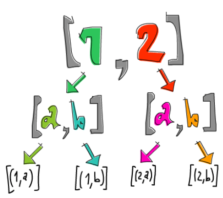

# 리스트 모나드

지금까지 실패할 수 있는 값인 Maybe에서 `>>=`를 사용해서 실패를 핸들링하는 방법을 살펴보았습니다. 여기서는 리스트의 모나드에서 코드의 비결정적 요소를 명확하기 읽기쉽게 가져오는 방법을 살펴보겠습니다. 

> 비결정적 값이란? 예를들어 `5`는 정확하게 우리가 알고있는 하나의 값을 가진것으로 결정적\(deterministic\)라고 한다. 반대로 여러개의 값을 가진 \[3,8,9\]는 실제로 여러개의 값이지만 동시에 하나의 값으로 볼 수 있는데, 이것이 비결정적 값\(non-deterministic\)이다.

이전 챕터에서 애플리케이티브에서 리스트를 어떻게 사용되는지 배웠습니다. 애플리케이티브 펑터인 리스트는 비결정적인 값을 보여주는 좋은 예입니다. 

```haskell
ghci> (*) <$> [1,2,3] <*> [10,100,1000]  
[10,100,1000,20,200,2000,30,300,3000]
```

왼쪽 리스트와 오른쪽 리스트의 모든 가능한 조합을 반환합니다. 비결정적 데이터는 많은 경우의 수를 만들 수 있고, 따라서 모든 경우의 수를 다 시도합니다. 따라서 비결정적 값은 더 많은 결과를 내게 됩니다. 이러한 비결정적 컨텍스트는 모나드를 해석하기에 매우 용이합니다. 그럼 이제 본격적으로 리스트 모나드가 어떻게 생겼는지 살펴보겠습니다. 

```haskell
instance Monad [] where  
    return x = [x]  
    xs >>= f = concat (map f xs)  
    fail _ = []
```

`return`은 `pure`와 동일합니다. 따라서 값을 최소 기본 컨텍스트\(빈리스트\)안에 넣습니다. 즉, 해당 값만 가진 리스트를 만들어 줍니다. 이렇게 일반적인 값을 리스트로 래핑하면 비결정적 값들과 상호작용할 수 있습니다. 

리스트 `>>=`의 동작을 이해하기 위해서는 일단 한번 써보는것이 좋습니다. `>>=`는 어떤 컨텍스트안의 모나드 값을 일반 값을 받아서 해당 컨텍스트를 반환하는 함수에 입력으로 넣어줍니다. 만약 함수가 컨텍스트가 아닌 일반적인 값을 반환한다면, `>>=`를 사용하는 것은 적합하지 않습니다. 왜냐하면 한번 사용되면 컨텍스트를 잃게되기 때문입니다. 어쨋든 한번 사용해보겠습니다. 

```haskell
ghci> [3,4,5] >>= \x -> [x,-x]  
[3,-3,4,-4,5,-5]
```

Maybe에서 `>>=`를 사용했을때, 실패할 수 있는 상황에서 함수에 모나드 값을 넣었습니다. 리스트에서도 동일합니다. 비결정적 값 `[3,4,5]`에서 값을 꺼내서 `/x -> [x, -x]` 함수에 넣고, 모든 가능한 결과의 리스트를 얻었습니다. 이 함수는 어떤 숫자를 받아서 양수와 음수, 두개의 결과를 반환합니다. 따라서 `>>=`를 사용했을때 모든 숫자에 대한 양수, 음수의 리스트를 만들었습니다. 동작 과정에서 `[3,4,5]`를 람다 함수 `/x -> [x, -x]`에 모두 매핑하여 아래 결과를 얻습니다. 

```haskell
[[3,-3],[4,-4],[5,-5]]
```

모든 값이 람다에 적용된 중첩 리스트가 되었습니다. 마지막으로 중첩 리스트를 펼칩니다\(flatten\). 비결정적 값이 비결정적 함수에 적용되었습니다. 

비결정적인 상황은 실패도 지원합니다. 빈 리스트 `[]`는 결과가 없다는 것을 나타내기 때문에 Nothing과 유사합니다. 그래서 실패는 빈 리스트로 정의됩니다. 리스트에서 실패하는 예제는 아래와 같습니다. 

```haskell
ghci> [] >>= \x -> ["bad","mad","rad"]  
[]  
ghci> [1,2,3] >>= \x -> []  
[]  
```

첫번째 예에서는 람다 함수에 빈 리스트를 넣었습니다. 하지만 리스트에 값이 없기때문에 함수에 아무것도 전달되지 않고, 따라서 결과는 빈리스트입니다. 이러한 상황은 Nothing을 함수에 적용한 것과 유사합니다. 

두번째 예는 리스트의 값들을 함수에 전달하지만, 함수가 입력 값을 무시하고 빈 리스트를 반환해서 결과가 실패입니다. 

Maybe처럼 리스트도 `>>=`를 사용해서 여러개의 리스트를 체이닝할 수 있습니다. 

```haskell
ghci> [1,2] >>= \n -> ['a','b'] >>= \ch -> return (n,ch)  
[(1,'a'),(1,'b'),(2,'a'),(2,'b')] 
```

`[1, 2]`의 값들은 각각 `n`에 들어가서 `['a', 'b']`가 되고, `['a', 'b']`의 값들은 각각 `ch`에 들어갑니다. 그리고나서 `return (n, ch)`를 수행해서 `[(n, ch)]`가 됩니다. 여기서 `return (n, ch)`는 가능한 최소의 비결정적 리스트를 만듭니다. 

return은 입력된 값을 최소한의 컨텍스트에 래핑해서 넣기때문에, 다른 부가적인 영향을 주지는 않지만\(예를들어 Maybe가 실패하거나, 리스트에 값이 늘어나는..\) 어떤 결과를 반환합니다. 

> 비결정적 값이 상호작용할때 리스트의 모든 가능한 결과에 대한 분기로 나타내는 트리로 표현될 수 있습니다. \(아래 이미지 참고\)



위 동작을 _do_를 사용해서 재작성하면 아래와 같습니다.

```haskell
listOfTuples :: [(Int,Char)]  
listOfTuples = do  
    n <- [1,2]  
    ch <- ['a','b']  
    return (n,ch)
```

이렇게 작성하면 `n`이 `[1, 2]`의 모든 값을 받고, `ch`가 `['a', 'b']`의 모든 값을 받는 것이 좀 더 분명해집니다. Maybe처럼 모나드값에서 값을 추출해서 컨텍스트에서 `>>=`를 사용한 것처럼 취급할 수 있습니다. 여기서는 컨텍스트가 non-determinism입니다. 그리고 이것은 list comprehension을 사용해서 재작성 될 수 있습니다. 

```haskell
ghci> [ (n,ch) | n <- [1,2], ch <- ['a','b'] ]  
[(1,'a'),(1,'b'),(2,'a'),(2,'b')]
```

여기서도 _do_를 사용한 것과 동일한 일들이 일어납니다. `return (n, ch)` 대신 list comprehension의 출력 부분에서 `(n, ch)`를 사용해서 표현했습니다. 

사실 list comprehension은 리스트 모나드를 사용한 하스켈 문법일 뿐입니다. 결국 list comprehension과 _do_ 표기법은 `>>=`를 사용해서 비결정적 특징에 대한 연산을 수행하는 것입니다. 

List comprehension은 결과를 필터할 수 있습니다. 예를들어 어떤 숫자 리스트에서 `'7'` 문자를 포함한 숫자만 걸러낼 수 있습니다. 

```haskell
ghci> [ x | x <- [1..50], '7' `elem` show x ]  
[7,17,27,37,47]  
```

예제에서는 `show`를 사용하여 숫자를 문자열로 변환한 다음, 문자 `'7'`이 문자열에 포함되어 있는지 확인합니다. List comprehension에서 필터링이 리스트 모나드로 어떻게 변환되는지 보려면 `guard` 함수와 `MonadPlus` 타입클래스를 알아야 합니다. `MonadPlus`는 모나드로 동작할 수 있는 모노이드\(monoid\)를 위한 타입클래스입니다.

```haskell
class Monad m => MonadPlus m where  
    mzero :: m a  
    mplus :: m a -> m a -> m a 
```

`mzero`는 `Monoid` 타입클래스의 `mempty`와 같고, `mplus`는 `mappend`와 동일합니다. 왜냐하면 리스트는 모나일뿐만 아니라 모노이드이기 때문입니다. 리스트를 `MonadPlus`의 인스턴스로 만들면 아래와 같습니다.  

```haskell
instance MonadPlus [] where  
    mzero = []  
    mplus = (++)
```

리스트에서 `mzero`는 결과가 없는 비결정적 연산\(실패 연산\)을 나타냅니다. `mplus`는 두개의 비결정적값을 하나로 합치는 것입니다. `guard` 함수는 아래와 같이 정의되어 있습니다.

```haskell
guard :: (MonadPlus m) => Bool -> m ()  
guard True = return ()  
guard False = mzero
```

`guard` 함수는 `boolean` 값을 받아서 참이면 `()`를 최소한의 기존 컨텍스트안에 넣어서 여전히 성공인 상태를 유지한다. 거짓이면 실패한 모나드값을 반환한다.

```haskell
ghci> guard (5 > 2) :: Maybe ()  
Just ()  
ghci> guard (1 > 2) :: Maybe ()  
Nothing  
ghci> guard (5 > 2) :: [()]  
[()]  
ghci> guard (1 > 2) :: [()]  
[]  
```

리스트 모나드에서는 이것은 비결정적 연산을 필터링하는데 사용합니다. 

```haskell
ghci> [1..50] >>= (\x -> guard ('7' `elem` show x) >> return x)  
[7,17,27,37,47] 
```

위 예제의 결과는 list comprehension과 동일합니다. 동작을 이해하기 위해서 `guard`가 `>>`와 함께 어떻게 동작하는지 보겠습니다.  

```haskell
ghci> guard (5 > 2) >> return "cool" :: [String]  
["cool"]  
ghci> guard (1 > 2) >> return "cool" :: [String]  
[] 
```

`Monad` 타입클래스에 있는 `>>`를 다시한번 살펴보면 아래와 같이 생겼습니다. 

```text
(>>) :: m a -> m b -> m b      
x >> y = x >>= \_ -> y
```

`guard`가 성공하면, 빈 튜플이 컨텍스트에 들어갑니다. 그다음에 `>>`는 빈 튜플을 무시하고 `return "cool"`의 결과를 반환합니다. 

`guard`가 실패하면, `>>=` 함수에 빈리스트가 들어가기 때문에 나중에 `return`이 실행되도 항상 빈 리스트를 반환합니다. `guard`는 조건문이 거짓이면 실패값\(`Nothing`, `[]`\)을 반환하고, 참이면 더미값 `()`를 넣어서 컨텍스트에 성공값을 반환해주는 함수입니다.

이전 예제를 _do_를 사용해서 재작성했습니다. 

```haskell
sevensOnly :: [Int]  
sevensOnly = do  
    x <- [1..50]  
    guard ('7' `elem` show x)  
    return x 
```

마지막에 return을 사용해서 x를 최종 결과로 표시하지 않으면 빈 튜플의 리스트가 되어버립니다. 다시 동일한 list comprehension과 비교해 보겠습니다. 

```haskell
ghci> [ x | x <- [1..50], '7' `elem` show x ]  
[7,17,27,37,47]
```

따라서 list comprehension에서 필터링은 `guard`를 사용한 것과 동일합니다. 


