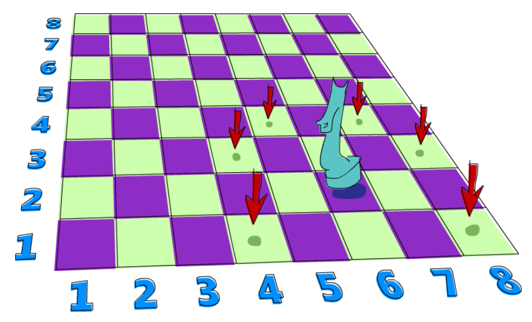

# 리스트 모나드 활용 예제

이번에는 비 결정론으로 해결되는 문제\(A knight's quest\)를 풀어보겠습니다. 체스판과 한개의 나이트 말만 가지고 있다고 가정하겠습니다. 우리는 나이트를 세번 움직여서 특정 위치에 도달할 수 있는지 알아내려고 합니다. 우리는 숫자의 쌍으로 체스판위에 나이트의 위치를 나타낼 것 입니다. 첫번째 숫자는 열\(column\), 두번째 숫자는 행\(row\)을 나타냅니다. 



먼저 체스판위에 나이트의 현재 위치에 대한 타입 동의어를 정의합니다. 

```haskell
type KnightPos = (Int,Int)
```

나이트가 `(6, 2)`에서 시작한다고 가정해 보겠습니다. 나이트는 3번안에 `(6, 1)`로 움직일 수 있을까요? 이것을 알아내기 위한 가장 좋은 방법은 전부 해보는 것 입니다. 나이트의 배치 방법이 비결정적이므로 한번을 움직이는 대신, 한번에 전부 선택하는 것 입니다. 아래 함수는 나이트의 위치를 받아서 다음에 움직일 수 있는 모든 위치들을 반환합니다. 

```haskell
moveKnight :: KnightPos -> [KnightPos]  
moveKnight (c,r) = do  
    (c',r') <- [(c+2,r-1),(c+2,r+1),(c-2,r-1),(c-2,r+1)  
               ,(c+1,r-2),(c+1,r+2),(c-1,r-2),(c-1,r+2)  
               ]  
    guard (c' `elem` [1..8] && r' `elem` [1..8])  
    return (c',r')
```

나이트는 수평 또는 수직으로 한번 움직이고, 수평, 수직 순으로 두번 움직일 수 있습니다. 예제에서 `(c',r')`는 나이트가 이동할 수 있는 모든 좌표의 리스트를 바인딩합니다. 그리고 나서 `guard`에서는 `(c',r')`가 여전히 체스판위인지 확인합니다. 만약 체스판에서 벗어나면 실패를 의미하는 빈 리스트를 반환하고, `return (c',r')`는 해당 위치를 반환하지 않습니다.

이 함수는 리스트 모나드를 사용하지 않고도 작성할 수 있습니다. 위 함수를 `filter` 함수를 사용해서 재작성하면 아래와 같습니다. 

```haskell
moveKnight :: KnightPos -> [KnightPos]  
moveKnight (c,r) = filter onBoard  
    [(c+2,r-1),(c+2,r+1),(c-2,r-1),(c-2,r+1)  
    ,(c+1,r-2),(c+1,r+2),(c-1,r-2),(c-1,r+2)  
    ]  
    where onBoard (c,r) = c `elem` [1..8] && r `elem` [1..8]
```

두 함수의 동작은 동일해서 선호하는 방법을 선택하면 됩니다. 실제로 사용하면 아래와 같습니다. 

```haskell
ghci> moveKnight (6,2)  
[(8,1),(8,3),(4,1),(4,3),(7,4),(5,4)]  
ghci> moveKnight (8,1)  
[(6,2),(7,3)]
```

하나의 위치를 받아서, 나이트가 이동 가능한 모든 위치의 리스트를 얻을 수 있습니다. `moveKnight` 함수를 `>>=`의 입력으로 넣으면, 나이트가 이동할 다음 위치에 대한 비결정적 결과들을 얻을 수 있습니다. 아래 함수는 나이트의 위치를 받아서 세번의 움직임으로 도달할 수 있는 모든 위치를 반환합니다. 

```haskell
in3 :: KnightPos -> [KnightPos]  
in3 start = do   
    first <- moveKnight start  
    second <- moveKnight first  
    moveKnight second 
```

예제에서 \(6, 2\)를 입력으로 넣으면, 꽤 큰 결과 리스트를 반환할 것 입니다. 왜냐하면 세번의 움직으로 도달할 수 있는 어떤 위치로 가는 방법이 상당히 많기 때문입니다. 이 함수를 _do_를 사용하지 않고 작성하면 아래와 같습니다. 

```haskell
in3 start = return start >>= moveKnight >>= moveKnight >>= moveKnight
```

`>>=`에 시작 위치를 넣으면 모든 가능한 이동 위치들을 반환하고, 두번째 `>>=`의 입력으로 주어집니다. 두번째 `>>=`에 의해서 모든 가능한 첫번째 이동에 대해 가능한 모든 다음 이동이 계산되어 집니다. 이렇게 세번째 `>>=`까지 진행되면 세번 이동으로 가능한 모든 위치를 알게됩니다. 

이제 두개의 위치를 받아서, 첫번째 위치에서 세번 이동해서 도달 가능한 위치인지 판단하는 함수를 만들어 보겠습니다. 

```haskell
canReachIn3 :: KnightPos -> KnightPos -> Bool  
canReachIn3 start end = end `elem` in3 start  
```

세번의 움직임으로 가능한 모든 위치들을 만들고, `end` 위치가 그 위치들에 포함되어 있는지 확인합니다. `(6, 2)`에서 `(6, 1)`까지 세번 움직여서 도달할 수 있는지 확인해보면 아래와 같습니다. 

```haskell
ghci> (6,2) `canReachIn3` (6,1)  
True
```

`(6, 2)`에서 `(7, 3)`은 도달할 수 없다는 것을 알 수 있습니다. 

```haskell
ghci> (6,2) `canReachIn3` (7,3)  
False  
```

이 함수를 변경하면 다른 위치에서 어떤 위치에 도달할 수 있을때, 이동할 위치를 알려줄 수 있습니다. 나중에 이 함수를 수정하는 방법을 보게 될 것입니다. 그때는 몇번 이동할지에 대한 값을 매개변수로 전달할 것 입니다.

